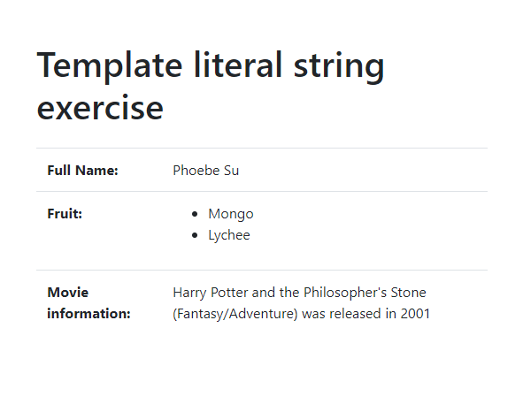

# 01 Exercise - JavaScript Template Strings

## Brief

Use JavaScript template literals strings `` `${}` `` to read from variables and create new strings




## Rationale

Using template strings are a quick and easy way to dynamically read from variables to create new strings.

---

## Getting Started

1. `clone` the exercise repository to your local computer.
- If you are not too sure how to do it, please follow this [video](https://www.loom.com/share/8a0d420720a94cb18021c2f418b19ae8?sid=b9435f7c-afd8-4031-88a3-44341f0e6b2f)
2. The code for this exercise should go into `/Submission/static/js/script.js`.

## Instructions

1. Open `Submission/index.html` in your browser with Live Server, and `Submission/static/js/script.js` in VS Code.
2. Follow the instructions in `Submission/static/js/script.js` to complete the variables using template strings

---

# Submit your Exercise

- [ ] Commits are pushed to GitHub
- [Tutorial Video for push your code](https://www.loom.com/share/e6fb52378eaf4636b62fc302f15b5aeb?sid=e6f68797-9dab-42b5-ae76-745316994fa6)

---

<details>
  <summary>
    Git CLI Refresher
  </summary>

```shell
# when ready to commit and push
git add .

git commit -m "Completed Part A"

git push
```

</details>

# Walkthrough Video

[video](https://www.loom.com/share/f10f5fbad4e14c4a8a7360209ef24786)
